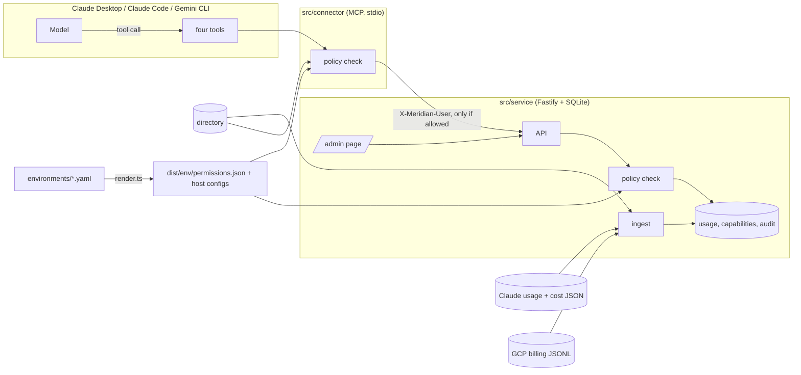

# Meridian usage connector

Meridian runs its staff assistant on both Claude and Gemini. The platform team wants one place to see who is using what and what it costs, to control which groups get which capabilities, and to let a team lead ask "how much did my team use last month?" from inside the assistant, seeing their own team and nobody else's.

This project does that in three pieces:

- a **usage service** that loads the Claude and Gemini exports into one model and exposes an API and a small admin page,
- an **MCP connector** that puts the same data inside the assistant, scoped to whoever is asking,
- **provisioning** that renders the permissions and the host config for dev, staging and prod from one command.

Everything is TypeScript on Node 20.

## Quick start

```bash
make setup        # npm ci
make provision    # render and validate dist/ for all three environments
make ci           # typecheck, drift check and the full test suite

make serve ENV=prod PORT=8083            # service and admin page at http://127.0.0.1:8083/admin
make bundle && node scripts/demo.mjs     # connector over real stdio, with its own fresh service
make package                             # plugin, Gemini extension and .mcpb per environment in build/
make tf-check                            # terraform output compared with dist/ (needs terraform 1.9+)
```

The first start loads `data/` into `var/<env>.sqlite`. `make ingest ENV=prod` reloads it and is safe to repeat.

## How it fits together



The code is one TypeScript project. `src/core` holds what the service and the connector share (policy, periods, money, directory). Around it: `src/service`, `src/connector`, `src/provisioning` and `test`. The starter kit files live in `environments/`, `contracts/` and `data/`, and `dist/` is the rendered output, committed.

## Where the usage data comes from

**Claude.** The Enterprise Analytics API, per user per day, split by product and model. Usage and cost are separate endpoints, so they have to be joined. Every row carries `rbac_group_id`, the group your identity provider synced into Claude, which means the platform already tells us the team.

**Gemini.** Vertex AI has no per-user usage API. Usage is billed per Google Cloud project, one row per project, day and SKU in the BigQuery billing export. Per-person numbers only exist because workloads set an `owner` label, so they are only as good as that labelling. This is why every fact keeps its source (RBAC group or project) next to it.

## Mapping two exports into one model

There is one fact table: day, user, platform, product, model. Dates are UTC and weeks are ISO weeks starting on Monday.

| | Claude | Gemini | In the model |
| --- | --- | --- | --- |
| Grain | user, day, product, model | project, day, SKU | user, day, product, model |
| Cost | cents as decimal strings | dollars as floats | integer nano-USD |
| Cost lines | `tokens` and `web_search` rows | one per SKU | added together |
| Tokens | uncached, cache read, cache write, output | separate input and output SKU rows | input + output = total |
| Time | RFC 3339 | `YYYY-MM-DD HH:MM:SS UTC` | date plus ISO week |
| Requests | present | not in the export | null, never 0 |

Money is stored as integer nano-USD. Claude's six-decimal cents don't fit in micro-dollars and floats drift, so Claude's strings are parsed without going through a float, and Gemini's floats are rounded to nine places first. The tests recompute totals from the raw files with separate arithmetic.

**People and groups.** A Claude row maps `actor.user_id` to a directory user and `rbac_group_id` to a group. A Gemini row maps the `owner` label (an email) to a user and then to a group, and uses the project only as a cross-check. A mismatch, an unknown owner or an unknown actor goes to `ingest_issue` and is never guessed. A row with the wrong shape (a missing field, a cost that isn't a decimal string) stops the ingest and names the file, row and field. The starter data is clean, so the issue paths are covered by tests with made-up bad rows. A user's group is stored when the row is ingested, so history stays with the team it was billed to.

**Periods.** `last_7_days` and `last_30_days` count back from the end of the data (2026-09-28), not from today. A period that runs past the data, like `2026-09`, comes back marked `partial`. "Last month" means `2026-08`.

## Permissions

There are two scopes, given to roles per environment:

| | dev | staging | prod |
| --- | --- | --- | --- |
| `usage:read` | member, team lead, admin; any group | team lead, admin; own group (admin: all) | same as staging |
| `capabilities:write` | team lead, admin | team lead, admin | admin |
| `usage-connector` | on | on | on for it-platform and clinical-operations |
| `code-execution` | on | off | off |

The rules:

1. A scope belongs to a role. Unknown roles and scopes are denied.
2. Having a scope doesn't widen the group: non-admins act on their own group (reads in dev are the one exception).
3. Writes are limited to the caller's own group for everyone except admins, in every environment. The environment files say who may write, not where, so this is a decision I made.
4. Platform admins can target any group.
5. If `usage-connector` is off for the caller's group, every connector tool is denied.
6. A denial looks like `{error: "permission_denied", reason, required_scope?}` and carries no data.

It is enforced in two places that use the same module (`src/core/policy.ts`):

- The **connector** starts as one directory user (`MERIDIAN_USER`) and takes that user's role and groups from the directory. It checks scope and group before calling the service, so a denied call never requests data. It also reads the user's `usage-connector` switch, and fails closed if the service is unreachable.
- The **service** checks again on every endpoint from the `X-Meridian-User` header, so the admin page and any other client get the same rules.

`contracts/policy-matrix.json` holds 29 cases across the three environments. It runs against the service alone and against the connector talking to the real service. The model only supplies tool arguments, never identity, so getting around the policy would mean finding arguments it accepts.

Platform admins can also act on individual users: see anyone's usage, force a capability on or off for one person (or clear it to follow the group), and suspend or restore them. All of it is admin-only and goes into the same audit log as the group switches. A suspended user is refused by the API and by the connector. The directory stays read-only because it stands in for the identity provider.

Identity is simulated: anyone who can reach the service can send any `X-Meridian-User`, and anyone who can edit the host config can change `MERIDIAN_USER`.

## Platforms and what I ran

One server serves both platforms. Everything was tested on Linux with Node 20.20.

- **Claude Code 2.1.286:** the rendered config connects as a team lead and as an admin, `claude plugin validate` passes for the three plugins, and I ran real model sessions through it (`docs/live-claude-session.md`).
- **Gemini CLI 0.40.0:** the extension installs and `gemini mcp list` shows it connected, with the identity coming from the extension's setting. I could not run a live prompt because the CLI rejects the account I had.
- **Claude Desktop:** `make package` builds and validates a `.mcpb` extension, and `dist/<env>/claude-desktop.json` is the plain config form. I started the packaged server with the manifest's own command and listed and called tools, but I never opened it in the Desktop app, which has no Linux build.

On how each platform scopes things: a Claude plugin carries skills and an `.mcp.json`, and its `userConfig` asks for the identity at install. A Gemini extension carries `mcpServers`, a context file, and `settings` that become environment variables.

## Provisioning

`make provision` renders and validates all three environments. It checks the JSON schema, roles and groups against the directory, capability names against the tool contract, server names for uniqueness, and a few prod guardrails (no "any group" reads, no member reads, only admins write). For each environment it writes the permissions manifest, a Claude Desktop config, a Gemini settings block, a Claude plugin, a Desktop extension and a Gemini extension.

`dist/` is committed and CI fails if it differs from a fresh render, so nothing is edited by hand. Terraform (`terraform/`) re-renders an environment when its inputs change. It only wraps the same script, so the manifest rules live in one place, and `make tf-check` proves its output matches `dist/`.

## Testing

`make ci` runs the typecheck, the drift check and the whole suite. The suite covers the mapping against the raw files, the permission matrix, the API, the connector (including a client that lists tools first and validates results, as real hosts do), the renderer and its command line, and headless-Chrome checks of the admin page. CI on GitHub runs the same commands, plus Terraform and plugin validation.

## Key decisions

- **One language.** The brief allows Python or TypeScript. The permission rules have to be enforced in the connector and in the service, and one language lets both use the same module. It also means one toolchain and test runner, and types shared with the tool contract. The price is that exact money needs care in JavaScript.
- **Fastify, zod and `better-sqlite3`.** The synchronous driver means one connection can't interleave statements. SQLite is plenty here, and a real deployment would use Postgres.
- **Local stdio, not a remote server**, because the brief asks for a local Desktop server. Remote HTTP with OAuth is the real-world path.
- **Tool results** are the contract JSON as text, plus `structuredContent` on success. Denials and errors are `isError` results with text only, because a strict client rejects structured content that doesn't match the output schema.
- **Terraform calls the script** and doesn't redo its rules in HCL.

## Standards

A single shared policy module with a conformance matrix, tests that check the mapping against the raw files, strict `tsc` in CI, idempotent ingest, failing closed, and a drift check on rendered config.

Skipped: a linter or formatter, real authentication, pagination, database migrations, load tests, a full UI test suite, and real cloud resources in Terraform.

## Known limits

- `web-search` and `code-execution` are stored and shown but nothing enforces them. Only `usage-connector` has an effect.
- The `usage-connector` check lives in the connector, so the API and admin page still work for a group whose connector is off.
- The list of people behind the user switcher (`/api/v1/identities`) is open, even in prod, because the simulated switcher needs it. It goes away with the header in a real deployment.
- In staging a team lead can switch off their own `usage-connector` and lock themselves out until an admin turns it back on.
- Capability writes are last write wins; everything is in the audit table.
- Every directory user has one group. Multi-group users work in code but no real data uses them.
- A month view of a boundary week only counts the days inside the month.
- Ingest is a manual, replace-all run (it also runs on first start).
- The admin page is plain HTML and JavaScript. The simulated user is picked in the page and remembered in `localStorage`, and `MERIDIAN_UI_DEFAULT_USER` sets who it starts as.
- Asked for "last month", the model tends to pick September (partial) instead of August. Naming the month avoids it.

## How I used AI tools

I built this with Claude Code, with the `mcp-builder` skill for the tool design and a stricter code-quality review near the end. The tests and the permission matrix are what I trusted, and they caught several things the model got wrong:

- a mistyped group in `enabled_for` was silently ignored by the renderer,
- denials broke strict MCP clients, because my first tests never listed tools before calling them,
- two command-line parsing bugs, found only because a test started the real process,
- a host config that pointed at an unbundled file, and Gemini's extension command hanging for input.

The review also led to typing the export and config boundaries with zod, one shared place for the caller check, and a single audit log.

## What I would do next

A remote streamable-HTTP connector with OAuth, real token checks in the service, Terraform for real infrastructure, a proper model-in-the-loop evaluation instead of a few hand-run sessions, a live Gemini session on an eligible account, and real enforcement for the other two capabilities.

## In the real enterprise version

- **Identity provider.** Okta or Entra with SSO and SCIM replaces the JSON directory, and roles come from group claims. The connector would send an OAuth token and the service would work out the user itself, so the header goes away.
- **Connector registry.** An admin registers the connector once as a custom connector (remote URL, OAuth) and controls it with the organisation's connector, per-tool and plugin settings. Local per-user config disappears, and SCIM-synced groups decide who gets it. The `usage-connector` switch would map onto that registry instead of a local table.
- **Usage APIs.** The Analytics API with pagination, incremental pulls and late data, and the BigQuery billing export with credits, adjustments and currencies. Ingest becomes a scheduled, monitored job that reconciles against invoices.
- **Infrastructure.** Postgres, the service behind a gateway, Terraform with real providers per environment, secrets management, audit logs shipped to a SIEM, rate limits and on-call.
